# 📊 Sơ đồ luồng hệ thống Math Chatbot

## 1. Kiến trúc tổng quan hệ thống

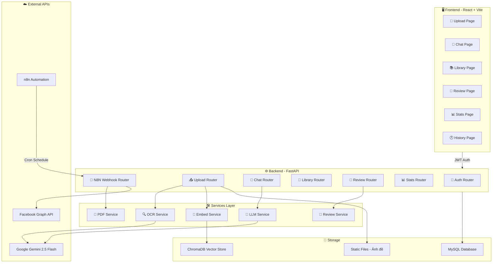

---

## 2. Luồng OCR — Upload ảnh đề thi

> **Endpoint:** `POST /api/upload/exam-image`
> **Files:** [upload.py](file:///d:/CODE/TA-ChatBot2/backend/app/routers/upload.py), [ocr_service.py](file:///d:/CODE/TA-ChatBot2/backend/app/services/ocr_service.py), [embed_service.py](file:///d:/CODE/TA-ChatBot2/backend/app/services/embed_service.py)

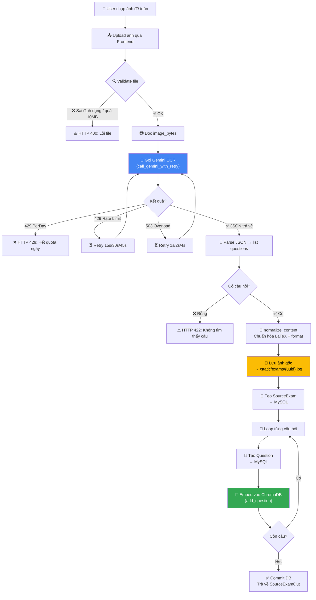

### Chi tiết xử lý OCR

| Bước | Component | Mô tả |
|------|-----------|-------|
| Validate | `upload.py` | Kiểm tra MIME type (JPEG/PNG/WEBP/HEIC), kích thước ≤ 10MB |
| OCR | `ocr_service.py` | Gemini 2.5 Flash + Structured Output (JSON schema) |
| Retry | `call_gemini_with_retry()` | 429 per-minute → wait 15s; 503 → exponential backoff |
| Normalize | `normalize_content()` | `\[...\]` → `$$...$$`, `\(...\)` → `$...$`, ép xuống dòng đáp án |
| Embed | `embed_service.py` | ChromaDB lưu vector content + metadata (topic, difficulty) |

---

## 3. Luồng Chat AI — Hỏi bài gia sư

> **Endpoints:** `POST /api/chat/sessions`, `POST /api/chat/sessions/{id}/messages`
> **Files:** [chat.py](file:///d:/CODE/TA-ChatBot2/backend/app/routers/chat.py), [llm_service.py](file:///d:/CODE/TA-ChatBot2/backend/app/services/llm_service.py)

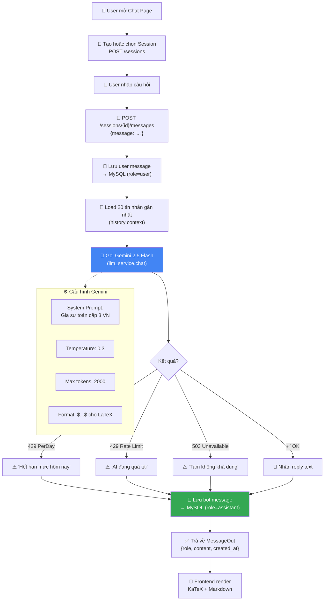

---

## 4. Luồng Ôn tập — Spaced Repetition (SM-2)

> **Endpoints:** `GET /api/review/needs-review`, `POST /api/review/questions/{id}/mark-reviewed`, `POST /api/review/generate`
> **Files:** [review.py](file:///d:/CODE/TA-ChatBot2/backend/app/routers/review.py), [review_service.py](file:///d:/CODE/TA-ChatBot2/backend/app/services/review_service.py)

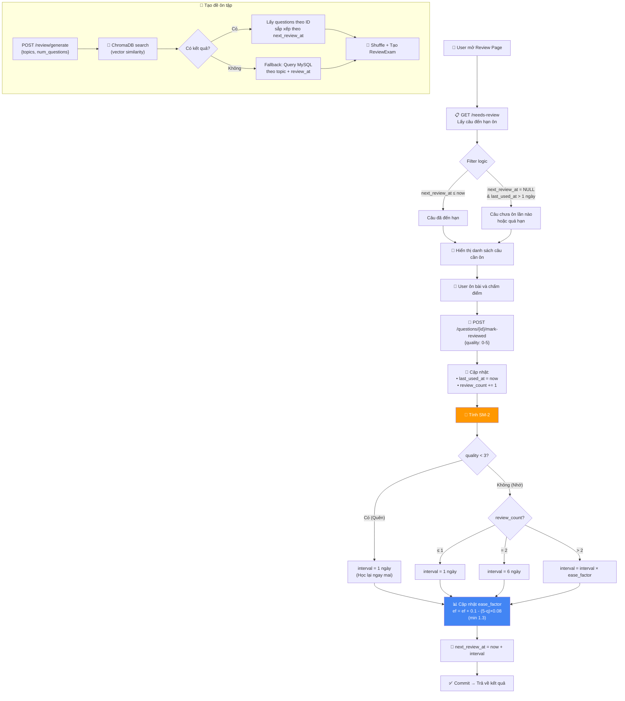

### Bảng tham số SM-2

| Quality | Ý nghĩa | Hành động |
|---------|---------|-----------|
| 0 | Quên hoàn toàn | Reset interval → 1 ngày |
| 1 | Nhớ rất khó | Reset interval → 1 ngày |
| 2 | Nhớ khó khăn | Reset interval → 1 ngày |
| 3 | Nhớ được (mặc định) | Tăng interval bình thường |
| 4 | Nhớ dễ dàng | Tăng interval bình thường |
| 5 | Rất dễ | Tăng interval bình thường |

---

## 5. Luồng Thông báo Messenger (n8n + Facebook)

> **Endpoints:** `POST /api/n8n/webhook`, `GET /api/n8n/users-due`
> **Files:** [n8n_webhook.py](file:///d:/CODE/TA-ChatBot2/backend/app/routers/n8n_webhook.py), [pdf_service.py](file:///d:/CODE/TA-ChatBot2/backend/app/services/pdf_service.py)

### 5a. Luồng nhận tin nhắn từ Messenger

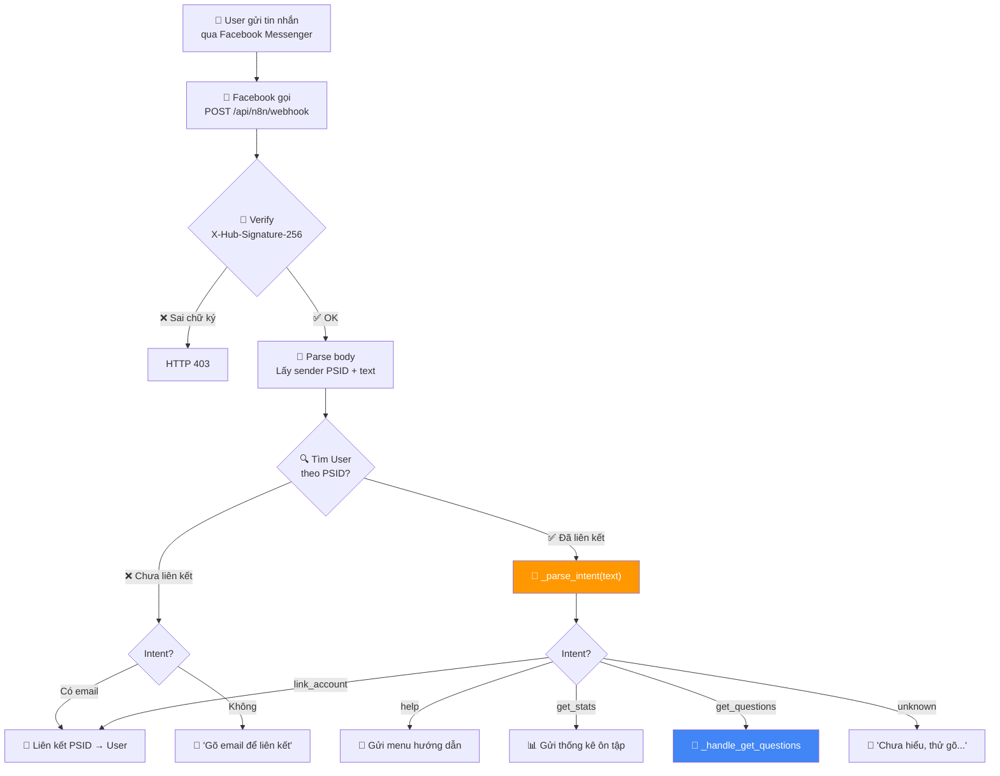

### 5b. Luồng xử lý "gửi câu hỏi" qua Messenger

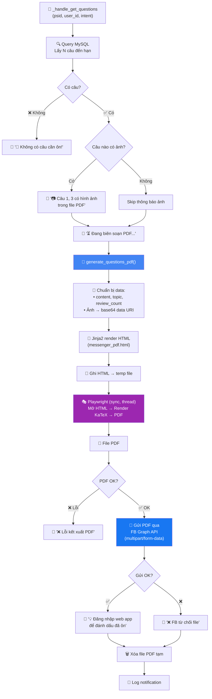

### 5c. Luồng nhắc nhở tự động (n8n Cron)

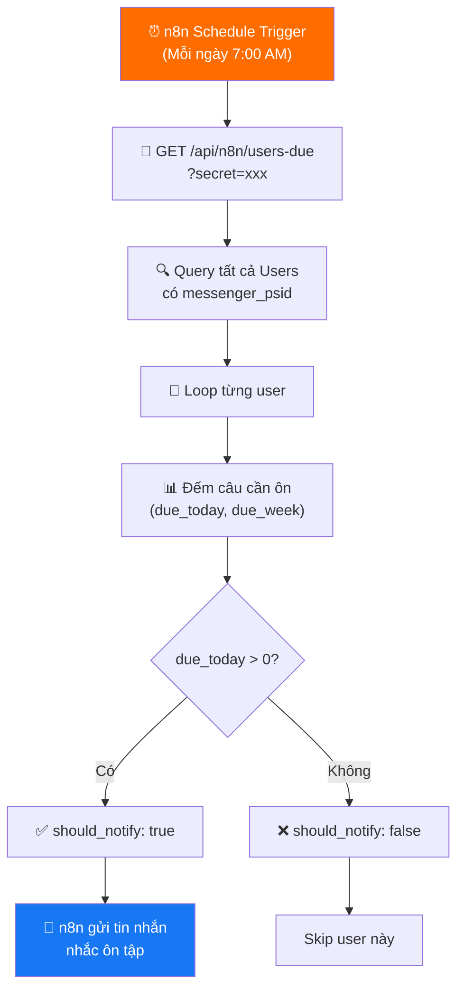

### 5d. Luồng phân tích Intent

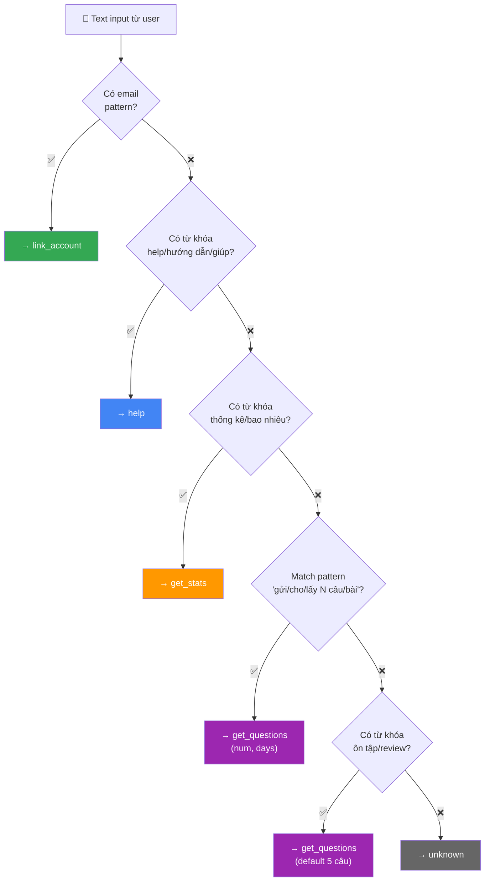

---

## 6. Luồng Thư viện câu hỏi

> **Endpoints:** `/api/library/folders/*`, `/api/library/sets/*`
> **File:** [library.py](file:///d:/CODE/TA-ChatBot2/backend/app/routers/library.py)

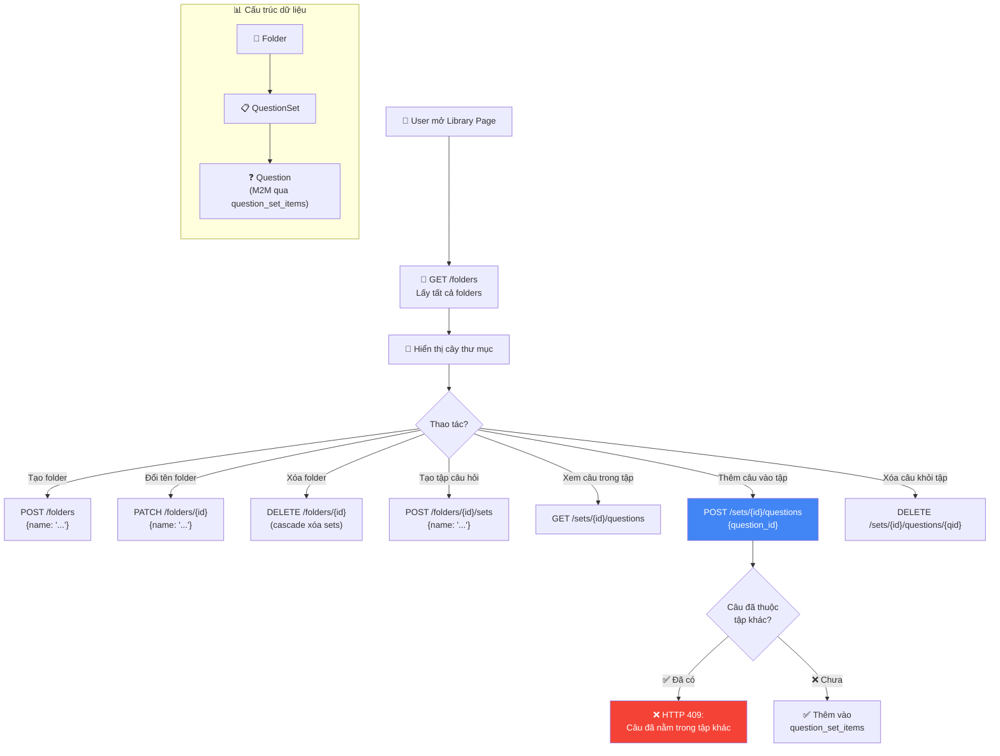

---

## 7. Luồng Xác thực (Authentication)

> **Endpoints:** `POST /api/auth/register`, `POST /api/auth/login`, `GET /api/auth/me`
> **File:** [auth.py](file:///d:/CODE/TA-ChatBot2/backend/app/routers/auth.py)

```mermaid
flowchart TD
    subgraph Register["📝 Đăng ký"]
        A1["POST /auth/register\n{name, email, password, grade}"]
        A1 --> A2{"Email đã tồn tại?"}
        A2 -->|"✅"| A3["❌ HTTP 400"]
        A2 -->|"❌"| A4["🔐 hash_password(bcrypt)"]
        A4 --> A5["💾 Tạo User → MySQL"]
        A5 --> A6["🎫 create_token(JWT)\nTrả về {access_token, user}"]
    end

    subgraph Login["🔑 Đăng nhập"]
        B1["POST /auth/login\n{email, password}"]
        B1 --> B2{"User tồn tại?\nPassword đúng?"}
        B2 -->|"❌"| B3["❌ HTTP 401"]
        B2 -->|"✅"| B4["🎫 create_token(JWT)\nTrả về {access_token, user}"]
    end

    subgraph Protected["🛡️ Protected Routes"]
        C1["Request với header:\nAuthorization: Bearer {token}"]
        C1 --> C2["🔐 get_current_user()"]
        C2 --> C3{"Token hợp lệ?"}
        C3 -->|"❌"| C4["❌ HTTP 401"]
        C3 -->|"✅"| C5["✅ Trả về User object\n→ Inject vào route handler"]
    end

    subgraph Messenger_Link["🔗 Liên kết Messenger"]
        D1["GET /auth/messenger-status"]
        D1 --> D2["Trả về {linked, psid}"]
        D3["POST /auth/unlink-messenger"]
        D3 --> D4["Xóa messenger_psid\n→ Hủy liên kết"]
    end

    style A6 fill:#34a853,color:#fff
    style B4 fill:#34a853,color:#fff
    style C5 fill:#4285f4,color:#fff
```

---

## 8. Luồng Thống kê (Stats & Gamification)

> **Endpoints:** `GET /api/stats/overview`, `POST /api/stats/session/start`, `POST /api/stats/session/end/{id}`
> **File:** [stats.py](file:///d:/CODE/TA-ChatBot2/backend/app/routers/stats.py)

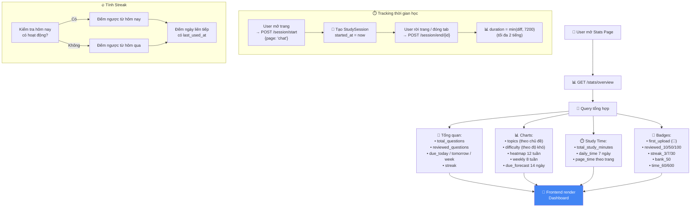

---

## 9. Sơ đồ Database (Entity Relationship)

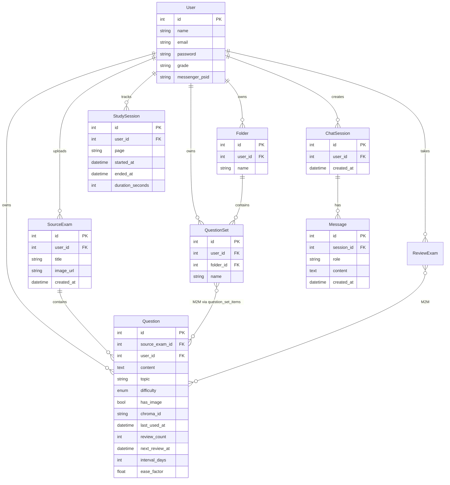
